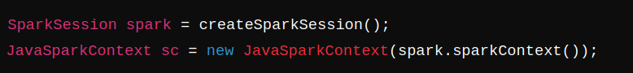
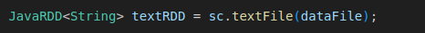
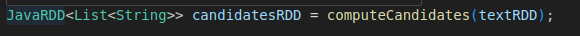
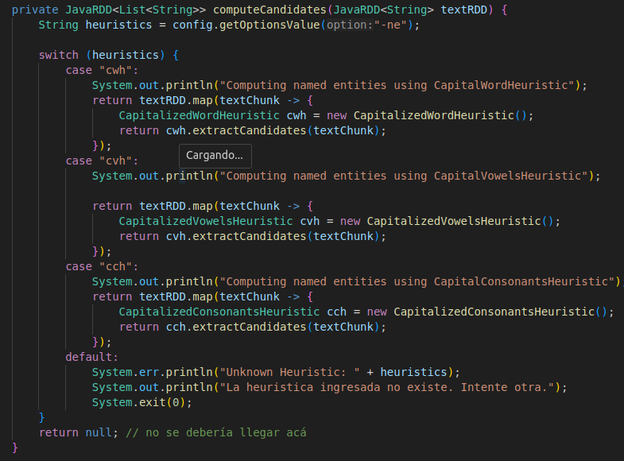
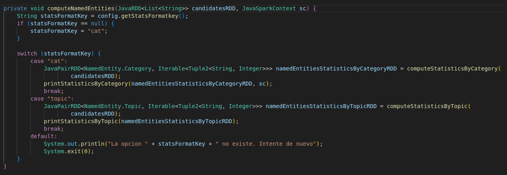
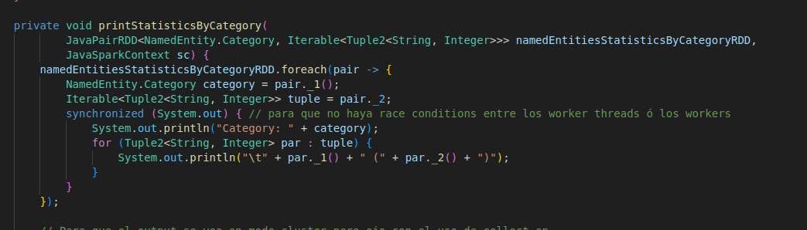
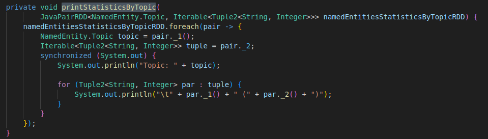
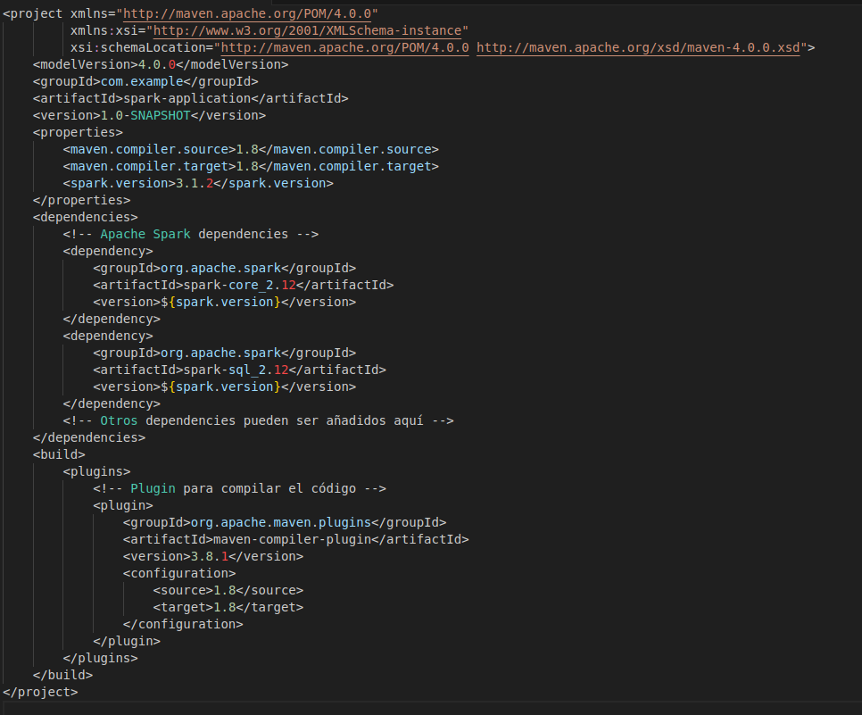

# Informe Laboratorio 3: Computación Distribuida con Apache Spark y Java
author: Alvarez Ernesto, Frattini Nicolas, Gomez Ignacio

Se puede ver la consigna del laboratorio en https://docs.google.com/document/d/e/2PACX-1vQn5BpCPQ6jKMN-sz46261Qot82KbDZ1RUx8jNzAN4kBEAq_i97T3R6ZA0_yRA5elN66e-EArXQXuAh/pub

## Pasos a seguir para ejecutar el laboratorio
- [ ] Instalar [maven](https://maven.apache.org/guides/getting-started/maven-in-five-minutes.html) Es probable que sea un paquete de tu distribución (`$ sudo apt install maven` si estás en Ubuntu, Debian o derivados).
- [ ] Descargar [spark 3.5.1](https://www.apache.org/dyn/closer.lua/spark/spark-3.5.1/spark-3.5.1-bin-hadoop3.tgz) y descomprimirlo en el directorio `DIR`.
- [ ] Definir variable de entorno `export SPARK_HOME=<DIR>` (ahí `<DIR>` es el directorio donde descomprimieron spark). 

> �9�8 Aclaración
> Nosotros configuramos maven para que pueda ser corrido en otro directorio fuera del `APP_HOME` pero en caso de fallar si ejecutar los binarios de spark con la variable de entorno `SPARK_HOME` desde el directorio del laboratorio.

## Cómo compilarlo

Sea `APP_HOME` el directorio donde está este el laboratorio

```bash
$ cd $APP_HOME
$ mvn install
```
Eso descarga las dependencias que necesitamos y crea el directorio `target` donde queda el jar que nos interesa.
En nuestro caso:
```
$ ls target
classes  generated-sources  lab3-D50-0.1.jar  maven-archiver  maven-status
```
Si se hace algún cambio al programa, se recomienda compilar de nuevo con `mvn clean install`.

## Cómo usarlo

En el directorio `$SPARK_HOME`, siendo n el número de worker threads que quiera utilizar:
```bash
$ ./bin/spark-submit --master local[n] $APP_HOME/target/lab3-D50-0.1.jar <args>
```
Por ejemplo, para computar todos los feeds con la heuristica CapitalWordHeuristic, donde la "big data" serían todos los feeds (title + description)
```bash
$ ./bin/spark-submit --master local[n] $APP_HOME/target/lab3-D50-0.1.jar -ne cwh
```

Si no se quiere ver la información de spark puede redirigir `stderr` a `/dev/null`:
```bash
$ ./bin/spark-submit --master local[n] $APP_HOME/target/lab3-D50-0.1.jar <args> 2>/dev/null
```

En caso de querer computar un archivo de texto externo,
```bash
$ ./bin/spark-submit --master local[n] $APP_HOME/target/lab3-D50-0.1.jar -ne <heuristica> --spark <file> 2>/dev/null
```
También se puede ejecutar en modo cluster,
```bash
$ ./bin/spark-submit --master spark://<hostname>:7077 $APP_HOME/target/lab3-D50-0.1.jar -ne <heuristica> --spark <file> 2>/dev/null 
```
Luego para cada worker va a necesitar una shell diferente y ejecutar:
```bash
$ ./bin/spark-class org.apache.spark.deploy.worker.Worker spark://<hostname>:7077 -m <cant-memoria> -c <cant-cores>
```

> �9�5 Observación
> Notar que si usa `zsh`, puede ser que para `local[n]` tenga que ponerlos entre comillas.

## Introducción
La programación distribuida es una técnica fundamental en la computación moderna que permite distribuir tareas y procesos entre múltiples nodos en una red. Este enfoque mejora la eficiencia, escalabilidad y tolerancia a fallos de las aplicaciones. Los frameworks de programación distribuida proporcionan las herramientas y abstracciones necesarias para desarrollar aplicaciones distribuidas de manera más sencilla y efectiva. Este informe explora los conceptos clave de la programación distribuida y los frameworks, utilizando el ejemplo de una aplicación en Java que procesa feeds de noticias y computa entidades nombradas. Además, se incluye una sección sobre cómo configurar Apache Spark en un proyecto Maven.
## Conceptos Básicos de Programación Distribuida

La programación distribuida se basa en la idea de dividir una tarea compleja en sub-tareas más peque�0�9as que pueden ser ejecutadas en paralelo en diferentes nodos de una red. Esto permite aprovechar la capacidad de procesamiento de múltiples máquinas para completar tareas de manera más rápida y eficiente. Los componentes clave de la programación distribuida incluyen:

1. **Nodos y Clústeres**: Los nodos son las unidades individuales de procesamiento en una red. Un clúster es un conjunto de nodos que trabajan juntos para ejecutar una aplicación distribuida.
2. **Comunicación entre Nodos**: Los nodos en un sistema distribuido deben comunicarse entre sí para coordinar la ejecución de tareas. Esto se logra a través de protocolos de comunicación como RPC (Remote Procedure Call) y mensajes.
3. **Coordinación y Sincronización**: Para asegurar que las tareas se ejecuten de manera ordenada y eficiente, es necesario coordinar y sincronizar las operaciones entre los nodos. Herramientas como Apache Zookeeper pueden ser utilizadas para esta finalidad.
4. **Tolerancia a Fallos**: En un sistema distribuido, es fundamental manejar fallos de nodos individuales sin afectar la operación general del sistema. Esto se logra mediante la replicación de datos y la re-distribución de tareas fallidas a otros nodos.
    
## Frameworks de Programación Distribuida

Los frameworks de programación distribuida proporcionan las herramientas y abstracciones necesarias para desarrollar y gestionar aplicaciones distribuidas. Algunos de los frameworks más utilizados incluyen:

1. **Apache Hadoop**: Framework para el procesamiento de grandes conjuntos de datos en clústeres de computadoras. Utiliza el modelo de programación MapReduce.
2. **Apache Spark**: Framework de procesamiento distribuido que permite realizar operaciones de análisis de datos en memoria. Es conocido por su velocidad y capacidad para manejar tanto batch processing como stream processing.
3. **Akka**: Toolkit para la construcción de aplicaciones concurrentes, distribuidas y resilientes en la JVM. Utiliza el modelo de actores para manejar la concurrencia y distribución.

## Funcionamiento del programa con Apache Spark
En el programa, las funcionalidades de Spark estan implementadas de forma que se permita el manejo de grandes volumenes de datos pero a la vez intentando mantener el entendimiento del mismo, por eso, algunas facilidades se encuentran en el archivo SparkNamedEntityProcessor, el cual se encarga de gran parte del proceso de estadisticas en la extracción de entidades nombradas. Este guarda los candidatos en un RDD para luego filtrar con las heuristicas según el input de usuario, imprimiendo las estadisticas computadas cuando sea llamada. También estan implementados los métodos de conteo e impresión de estadisticas por categoria y tópico optimizados al trabajar parelelamente en el Cluster.
Como SparkNamedEntityProcessor es llamado en el método principal es el responsable de que la aplicación de Apache Spark en el programa sea realmente significativa a la hora de paralelizar las tareas. Además modularizamos `App.java` para que no sea tan larga y ahora el manejo de cualquier flag que tenga que ver con los feeds (como `-f`, `pf`, etc.) lo maneja la nueva clase `FeedManager` pero la flag de las heuristicas se sigue manejando en `App.java`.

## Aplicación Distribuida en Java con Apache Spark
Consideremos nuestro programa en Java que procesa feeds de noticias y computa entidades nombradas. Esta aplicación puede beneficiarse de la programación distribuida utilizando Apache Spark. Para mantener la abstracción, creamos una nueva clase `SparkNamedEntityProcessor` dentro del paquete `named_entities.utils` que hereda de `NameEntityProcessor` para reutilizar funciones como `extractNamedEntitiesByCategory` y `extractNamedEntitiesByTopic`. Además implementamos los métodos estáticos `countEntitiesByCategory` y `countEntitiesByTopic` que si bien tienen el mismo nombre que en su superclase `NameEntityProcessor` ambos métodos son estáticos y tienen distintos tipos de retorno y argumentos (no es *method overriding* sino *method hiding*).
El constructor de la clase toma un objeto `Config` y un string que contiene el nombre de un archivo de texto (pueden ser todos los feeds u otro).

A continuación, se presenta un análisis de cómo se estructura esta aplicación:

El método `processNamedEntities` es el núcleo del procesamiento de entidades nombradas en el archivo de texto. Este método comienza creando una sesión de Spark mediante la llamada a createSparkSession(). Una sesión de Spark es esencialmente el punto de entrada principal para interactuar con las capacidades de Spark, proporcionando una interfaz para trabajar con los datos distribuidos.



Una vez que la sesión de Spark está creada, el método procede a instanciar un JavaSparkContext a partir del contexto de Spark de la sesión. El JavaSparkContext es una clase que permite a las aplicaciones Java interactuar con Spark y es necesario para realizar operaciones de RDD (Resilient Distributed Dataset).

A continuación, el método lee el archivo de datos especificado en el atributo dataFile y lo carga en un RDD de Spark utilizando el método sc.textFile(dataFile). Este método convierte el archivo de texto en un JavaRDD<String>, donde cada elemento del RDD es una línea del archivo.



El siguiente paso es calcular los posibles candidatos a entidades nombradas a partir de las líneas de texto. Esto se logra llamando al método `computeCandidates(textRDD)`, que aplica una heurística configurada para identificar posibles entidades. Este método devuelve un JavaRDD<List<String>>, donde cada elemento es una lista de posibles entidades nombradas extraídas de una línea de texto.





El método `computeCandidates` obtiene la heurística configurada desde el objeto config usando config.getOptionsValue("-ne"). Dependiendo del valor de esta configuración, se aplica una de las tres heurísticas disponibles: CapitalWordHeuristic, CapitalVowelsHeuristic o CapitalConsonantsHeuristic. Si la heurística configurada no es reconocida, el método imprime un mensaje de error y termina la ejecución.





Después de obtener los candidatos a entidades nombradas, el método `processNamedEntities` llama a `computeNamedEntities(candidatesRDD, sc)` para procesar estas listas de candidatos y generar estadísticas sobre las entidades nombradas. Este procesamiento puede incluir la categorización y el conteo de entidades, dependiendo de la configuración y las heurísticas aplicadas.

El método `computeNamedEntities` determina el formato de las estadísticas a generar basándose en una configuración obtenida con config.getStatsFormatkey(). Si la clave de formato no está configurada, se usa "cat" como valor predeterminado. Dependiendo del valor de statsFormatKey, el método realiza diferentes acciones.





Finalmente, el método `printStatisticsByCategory` imprime las estadísticas de las entidades nombradas agrupadas por categoría y `printStatisticsByTopic` imprime las estadísticas de las entidades nombradas agrupadas por topico, ambos de manera sincronizada para garantizar una salida ordenada y coherente, incluso en entornos distribuidos y paralelos como Spark.








## Configuración de Maven para Apache Spark

Maven es una herramienta de gestión y comprensión de proyectos en Java. Proporciona una forma estándar de crear proyectos Java y manejar sus dependencias de manera eficiente. Para configurar un proyecto Maven que utilice Apache Spark, es necesario agregar las dependencias de Spark en el archivo pom.xml.
### Configuración del archivo pom.xml
A continuación se muestra un ejemplo de configuración del archivo pom.xml para un proyecto que utiliza Apache Spark:



Este archivo pom.xml configura las dependencias necesarias para utilizar Apache Spark en un proyecto Java. La versión de Spark se especifica en las propiedades y se utiliza en las dependencias para spark-core y spark-sql.
Ventajas de Maven

1. **Gestión de Dependencias**: Maven permite gestionar las dependencias del proyecto de manera declarativa en el archivo pom.xml. Las dependencias se descargan automáticamente desde repositorios centrales.
2. **Estandarización de Proyectos**: Proporciona una estructura de proyecto estándar que facilita la comprensión y el mantenimiento del código.
3. **Automatización del Ciclo de Vida**: Maven automatiza el ciclo de vida del desarrollo, incluyendo la compilación, pruebas y empaquetado del código.
4. **Integración con Herramientas de Construcción**: Se integra fácilmente con herramientas de construcción y CI/CD (Integración Continua/Despliegue Continuo).

## Diferencias observadas entre modo cluster y modo local
En modo cluster ejecutamos la aplicación de la siguiente manera:
```bash
./bin/spark-submit --master spark://DESKTOP-DQE8BRN.:7077 $APP_HOME/target/lab3-D50-0.1.jar -ne cwh --spark data/wiki_dump_parcial.txt 2>/dev/null
```
El problema de ejecutar en modo cluster es que el comportamiento del `stdout`es diferente al modo local. En modo cluster, el driver program (el archivo `.jar`) corre en la máquina del cliente, mientras que los workers corren en distintos nodos en el cluster. Entonces, el output de los `System.out.println` dentro de las transformaciones de RDD, como `foreach`, y acciones ejecutadas en los workers no aparecen en la consola del driver program. No obstante, el output si se logra capturar en los logs de cada worker ó `executer`. Estos se pueden acceder en `http://localhost:4040/executors/`, debajo se puede ver una tabla que dice `Executors` que lista información sobre cada uno y la columna `logs` se puede acceder al `stdout` de cada executor. Una forma de "traer" un RDD al driver program es con el método `collect()` que carga en memoria el RDD en forma de lista pero si el RDD es muy grande eso puede hacer que el driver program se quede sin memoria. Una alternativa más segura de `collect()` es `take(n)` que selecciona n elementos del RDD para cargar en memoria entonces así se puede controlar más sobre cuantos datos se cargan en memoria. Como eliminamos la categoría `OTHER`, no tuvimos problemas de memoria tanto con `collect()` como con `take()` con al [archivo de texto](!https://drive.google.com/file/d/195gLyxOYFffCcv30tuD1AB_ZJe7MBQaN/view) que mando el profesor Pagano por Zulip (con 3 workers, 2 cores cada uno) ya que al ser un archivo muy grande la categoría `OTHER` se llenaba de elementos. 

En el modo cluster, el master contaba con 3 workers, 2 cores cada uno. La duración de la ejecución (obtenida en la web UI de Spark) fue de 7 minutos con el uso de `collect()` y con `take(10)` fue de 6.2 minutos. Sin el uso de `collect()` la duración fue de 6.5 minutos. Además, tanto con `collect()` como con `take()` la muestra de estadísticas no suele ser correcta como por ejemplo una entidad nombrada aparece más de una vez con distinto conteo ó que aparezca más de una vez una categoría con otros conteos y distintas entidades nombradas, algo que se puede ver debajo con **MercadoLibre**:
```bash
Category: ORGANIZATION
        MercadoLibre (2)
        FMI (178)
        Apple (816)
        SMN (21)
        MercadoLibre (3)
        MercadoLibre (1)
        Google (469)
        BocaJuniors (1217)
        SMN (38)
        Google (553)
        Instituto (3602)
        LLA (6)
        SMN (22)
        Talleres (264)
```
Por el otro lado, ejecutamos la aplicación localmente con 6 worker threads de la siguiente manera sin el uso de `collect()` obviamente 
En modo local ejecutamos la aplicación de la siguiente manera:
```bash
./bin/spark-submit --master "local[6]" $APP_HOME/target/lab3-D50-0.1.jar -ne cwh --spark data/wiki_dump_parcial.txt 2>/dev/null
```
y también la duración fue de aproximadamente 7 minutos. En este caso no sucede el comportamiento errático en la muestra de estadísticas, ver debajo la misma categoría:
```bash
Category: ORGANIZATION
        Shell (501)
        MercadoLibre (6)
        CorteSuprema (3364)
        Belgrano (2391)
        FMI (594)
        RiverPlate (3252)
        LLA (23)
        Apple (2521)
        BocaJuniors (3988)
        Talleres (916)
        Google (1438)
        Instituto (10636)
        SMN (81)
```
Creemos que el comportamiento errático se debe a un problema de sincronización de outputs entre los workers, mientras que en modo local los problemas de sincronización los solucionamos con la instrucción `synchonized(System.out)`. Aún así se puede ver que si, el output del modo cluster, se suma los conteos de cada ocurrencia de **MercadoLibre** se obtiene el mismo conteo que en el output del modo local. 

Cabe aclarar que las medidas de tiempo se realizaron pocas veces en una sola computadora para tener más o menos una idea de como afectan (si es que afectan) ciertas transformaciones a los RDD sobre el redimiento del programa. Tendríamos que realizar una análisis más exhaustivo para tener una idea clara si existe una relacion entre el rendimiento y la transformación de RDD usada.

## Conclusión
La programación distribuida, apoyada por frameworks como Apache Spark, ofrece una solución robusta y escalable para el procesamiento de grandes volúmenes de datos. La modularización del código y el uso de abstracciones proporcionadas por estos frameworks permiten desarrollar aplicaciones distribuidas de manera más eficiente y con menor esfuerzo. Maven, como herramienta de gestión de proyectos, simplifica la configuración y gestión de dependencias en proyectos Java, facilitando el desarrollo de aplicaciones distribuidas. Sin embargo, es crucial manejar los desafíos asociados con la complejidad y la tolerancia a fallos para aprovechar plenamente las ventajas de la programación distribuida.
