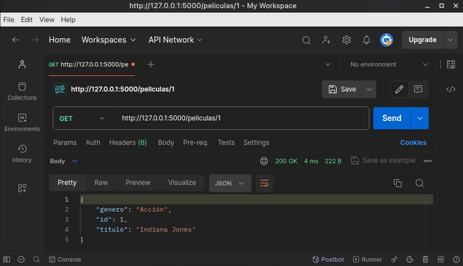

# Laboratorio 1: Desarrollo de una API

## Introducción al proyecto

El objetivo de este proyecto es comprender la implementación y uso de APIs (Application Programming Interface) ademas de incorporar fluidez y buenos hábitos en la programación con python.

### Este está dividido en *5 partes:*

1. **Configuración del Entorno:** Se inicia creando un entorno virtual con `virtualenv` para aislar las dependencias del proyecto y se expone las librerías a utilizar.

2. **Construcción de la API Principal:** Se desarrolla una *API* utilizando `Flask` para gestionar una base de datos de películas, incluyendo un campo para género.

3. **Integración con API de Feriados:** Se crea un modulo cuya función consiste en calcular el `proximo feriado` a través de una API externa para y disponer de esta característica en nuestra API cinematográfica.

4. **Evaluación de la API:** Se realizan pruebas exhaustivas, evaluando aspectos como la respuesta de la API mediante `postman`, `curl`, y `test unitarios`.

5. **Conclusiones:** Se exponen los resultados de la evaluación de la API y se propone posibles mejoras y/o ampliaciones para la misma


## **Parte 1:** *Configuración del entorno e instalación de librerías*

### ***venv:*** El Entorno Virtual:
> Según la documentación oficial, `venv` es un entorno cooperativamente aislado de ejecución que permite a los usuarios de Python y a las aplicaciones instalar y actualizar paquetes de distribución de Python sin interferir con el comportamiento de otras aplicaciones de Python en el mismo sistema.

#### Uso de ***venv***
1. Crea un entorno virtual de Python utilizando venv:
```bash
$ python3 -m venv .venv #
```
2. Activa y desactivar el entorno virtual:
```bash
$ source .venv/bin/activate
```
```bash
(.venv)$ deactivate
```
3 .Instalar las librerías necesarias:
```bash
(.venv)$ pip install -r requirements.txt

# Y para controlar estilos en desarrollo:
(.venv)$ pip install pep8
```

### ***Flask:*** Nuestro Framework Web:
> `Flask` es un framework minimalista escrito en Python que permite crear aplicaciones web rápidamente y con un mínimo número de líneas de código.

#### Uso de ***Flask***
1. Importación de la librería:
```python
from flask import Flask, jsonify, request

app = Flask(__name__)
peliculas = [
    {'id': 1, 'titulo': 'Indiana Jones', 'genero': 'Acción'},
    {'id': 2, 'titulo': 'Star Wars', 'genero': 'Acción'},
    {'id': 3, 'titulo': 'Interstellar', 'genero': 'Ciencia ficción'},
    ... 
   ]
```
2. Uso la función decorada `@app.route(<URL+Rules>, <Petition Method HTTP>)` para decir a Flask qué URL debería desencadenar nuestra función y que debería devolver.

   > Abajo se muestran algunas funciones que cumplen con el set **CRUD**(Create, Read, Update, Delete) correspondieses a las peticiones `POST`, `GET`, `PUT` y `DELETE` respectivamente para ilustrar el manejo de estas con Flask.

```python
@app.route('/peliculas', methods=['GET'])
def obtener_peliculas():
    return jsonify(peliculas)

@app.route('/peliculas', methods=['POST'])
def agregar_pelicula():
    # Extract new data from user...
    return jsonify(nueva_pelicula), 201

@app.route('/peliculas/<int:id>', methods=['PUT'])
def actualizar_pelicula(id):
   # Extract new upgraded from user...
   return jsonify(pelicula), 200
   # But if we have an error for upgrade...
   return jsonify({'mensaje': 'Película no encontrada'}), 404

@app.route('/peliculas/<int:id>', methods=['DELETE'])
def eliminar_pelicula(id):
   # Seach the film...
   return jsonify({'mensaje': 'Película eliminada'}), 200
```
3. Para ejecutar la aplicación:
```bash
(.venv)$
(.venv)$ export FLASK_APP=main.py
(.venv)$ export FLASK_ENV=development
(.venv)$ flask run
 * Serving Flask app 'hello'
 * Running on http://127.0.0.1:5000 (Press CTRL+C to quit)
```

## **Parte 2:** *Construcción de la API Principal:*

### Se implementan las siguientes funcionalidades a la API

- **Buscar** la película por su ID y **devolver** sus detalles.
- **Buscar** la película por su ID y **actualizar** sus detalles.
- **Buscar** la película por su ID y **eliminarla**.
- **Devolver** el listado de películas de un **género** específico.
- **Devolver** la lista de películas que tengan determinado string en el **título**.
- **Sugerencia** de una película **aleatoria**.
- **Sugerencia** de una película **aleatoria según género**.

> ***Nota:*** Para la implentacion de los 2 últimos puntos se recurió a la librería `random`.
```python
import random

```

> En *main.py* ahora tenemos:
```python
@app.route('/peliculas', methods=['GET'])
def obtener_peliculas():
    return jsonify(peliculas)


@app.route('/peliculas/<int:id>', methods=['GET'])
def obtener_pelicula(id):
    pelicula = next((p for p in peliculas if p['id'] == id), None)
    if pelicula:
        return jsonify(pelicula), 200
    return jsonify({'mensaje': 'Película no encontrada'}), 404


@app.route('/peliculas', methods=['POST'])
def agregar_pelicula():
    nueva_pelicula = {
        'id': obtener_nuevo_id(),
        'titulo': request.json['titulo'],
        'genero': request.json['genero']
    }
    peliculas.append(nueva_pelicula)
    print(peliculas)
    return jsonify(nueva_pelicula), 201


@app.route('/peliculas/<int:id>', methods=['PUT'])
def actualizar_pelicula(id):
    pelicula = next((p for p in peliculas if p['id'] == id), None)
    if pelicula:
        data = request.get_json()
        pelicula.update(data)
        return jsonify(pelicula), 200
    return jsonify({'mensaje': 'Película no encontrada'}), 404


@app.route('/peliculas/<int:id>', methods=['DELETE'])
def eliminar_pelicula(id):
    global peliculas
    peliculas = [p for p in peliculas if p['id'] != id]
    return jsonify({'mensaje': 'Película eliminada'}), 200


@app.route('/peliculas/genero/<string:genero>', methods=['GET'])
def peliculas_por_genero(genero):
    filtradas = [p for p in peliculas if p['genero'].lower() == genero.lower()]
    return jsonify(filtradas), 200


@app.route('/peliculas/buscar/<string:query>', methods=['GET'])
def buscar_peliculas(query):
    resultado = [p for p in peliculas if query.lower() in p['titulo'].lower()]
    return jsonify(resultado), 200


@app.route('/peliculas/sugerencia', methods=['GET'])
def sugerir_pelicula():
    pelicula = random.choice(peliculas)
    return jsonify(pelicula), 200


@app.route('/peliculas/sugerencia/<string:genero>', methods=['GET'])
def sugerir_pelicula_por_genero(genero):
    peliculas_genero = [p for p in peliculas if p['genero'].lower() == genero.lower()]
    if peliculas_genero:
        pelicula = random.choice(peliculas_genero)
        return jsonify(pelicula), 200
    return jsonify({'mensaje': 'No se encontraron películas del género solicitado'}), 404


def obtener_nuevo_id():
    if len(peliculas) > 0:
        ultimo_id = peliculas[-1]['id']
        return ultimo_id + 1
    return 1

```

## **Parte 3:** *Integración con API de Feriados:*

1. En el archivo `proximo_feriado.py` se utiliza la API de [nolaborables.com.ar](https://github.com/pjnovas/nolaborables) para obtener información sobre los [feriados en Argentina](https://www.argentina.gob.ar/interior/feriados-nacionales-2024). La aplicación busca y muestra el próximo feriado disponible.

>***Nota:*** Se corrigió el bug que cambiaba los días de la semana.

- En la [Documentación Oficial](https://docs.python.org/3/library/datetime.html) nos explica que el método `date.weekday()`: 
   *"Regresa el día de la semana como en un número entero, donde el lunes es 0 y el domingo es 6. Por ejemplo, date(2002, 12, 4).weekday() == 2, un miércoles."*

- Luego se cambia...
   ```python
   days = ['Domingo', 'Lunes', 'Martes', 'Miércoles', 'Jueves', 'Viernes', 'Sábado']
   ```
    por...
   ```python
   days = ['Lunes', 'Martes', 'Miércoles', 'Jueves', 'Viernes', 'Sábado', 'Domingo']
   ```
   para que funcione correctamente...
   ```python
   days[date(year, month, day).weekday()]
   ```

2. Se modifica el código para que agregar la opción de buscar feriados por tipo:
```python
inamovible | trasladable | nolaborable | puente
```

> En `set_next(self, holidays):`
```python
 # Considera el tipo de feriado en el filtrado
filtered_holidays = [h for h in holidays if h['tipo'] == self.holiday_type] if self.holiday_type else holidays
```

> Y se define...
```python
def fetch_holidays(self, holiday_type=None):
        self.holiday_type = holiday_type  # Almacena el tipo de feriado
        response = requests.get(get_url(self.year))
        if response.ok:
            data = response.json()
            self.set_next(data)
        else:
            print("Error al obtener los datos")
```

3. En la api de películas se implementa la API de feriados para agregar la siguiente funcionalidad: *Obtener la próxima fecha de feriado y recomendar una película que se ajuste al género solicitado para ese día*.

> En `main.py` ahora se suma...
```python
@app.route('/recomendar_pelicula_feriado/<string:genero>', methods=['GET'])
def recomendar_pelicula_feriado(genero):
    # Obtiene el próximo feriado
    next_holiday = NextHoliday()
    next_holiday.fetch_holidays()
    if not next_holiday.holiday:
        return jsonify({'mensaje': 'No se encontró el próximo feriado'}), 404
    
    # Filtra las películas por el género solicitado
    peliculas_genero = [p for p in peliculas if p['genero'].lower() == genero.lower()]
    if not peliculas_genero:
        return jsonify({'mensaje': 'No se encontraron películas del género solicitado'}), 404

    # Selecciona una película al azar del género solicitado
    pelicula_recomendada = random.choice(peliculas_genero)

    # Prepara la respuesta con la información del feriado y la película recomendada
    respuesta = {
        'proximo_feriado': {
            'fecha': f"{next_holiday.holiday['dia']} del {next_holiday.holiday['mes']}",
            'motivo': next_holiday.holiday['motivo']
        },
        'pelicula_recomendada': {
            'titulo': pelicula_recomendada['titulo'],
            'genero': pelicula_recomendada['genero']
        }
    }

    return jsonify(respuesta), 200
```

## **Parte 4:** *Evaluación de la API:*
### 1. Usar el archivo test.py
Se agregaron test para:


- Obtener peliculas de un género específico
```python
genero = "Acción"

response = requests.get(f"http://localhost:5000/peliculas/genero/"
                        f"{genero.encode('utf-8').decode('latin-1')}")

if response.status_code == 200:
   peliculas = response.json()
   print(f"Películas existentes del género {genero}")

    for pelicula in peliculas:
        print(f"ID: {pelicula['id']}, Título: {pelicula['titulo']},"
              f"Género: {pelicula['genero']}")
    print()

else:
    print(f"Error al obtener los detalles de las películas de {genero}.")
```

- Obtener peliculas que contengan una string específica
string = "In"
```python
response = requests.get(f"http://localhost:5000/peliculas/buscar/"
                        f"{string.encode('utf-8').decode('latin-1')}")

if response.status_code == 200:
    peliculas = response.json()
    print(f"Se encontraron al menos {len(peliculas)} " +
          f"coincidencias para {string}")

    for pelicula in peliculas:
        print(f"ID: {pelicula['id']}, Título: {pelicula['titulo']},"
              f" Género: {pelicula['genero']}")
    
    print()

else:
    print(f"Error al obtener los detalles de las películas "
          f"que contienen la string {string}.")
```

- Sugerir una pelicula random
```python
response = requests.get('http://localhost:5000/peliculas/sugerencia')

if response.status_code == 200:
    pelicula = response.json()

    print("Detalles de la película aleatoria:")
    print(f"ID: {pelicula['id']}, Título: {pelicula['titulo']}, "
          f"Género: {pelicula['genero']}")
    print()

else:
    print("Error al obtener los detalles de la película aleatoria.")
```

- Sugerir una pelicula random según genero
genero = "Acción"
```python
response = requests.get(f"http://localhost:5000/peliculas/sugerencia/"
                        f"{genero.encode('utf-8').decode('latin-1')}")

if response.status_code == 200:
   pelicula = response.json()
    print(f"Detalles de la película aleatoria del genero {genero}:")
    print(f"ID: {pelicula['id']}, Título: {pelicula['titulo']}, "
          f"Género: {pelicula['genero']}")
    print()

else:
    print(f"Error al obtener los detalles de "
          f"la película aleatoria de {genero}.")
```

- Sugerir una pelicula random según genero para ver en el próximo feriado
```python
genero = "Acción"
response = requests.get(f"http://localhost:5000/recomendar_pelicula_feriado"
                        f"/{genero.encode('utf-8').decode('latin-1')}")

if response.status_code == 200:
    pelicula = response.json()
    print(f"Detalles de la película aleatoria del genero "
          f"{genero} en el próximo feriado:")
    print(f"ID: {pelicula['pelicula_recomendada']['id']}, "
          f"Título: {pelicula['pelicula_recomendada']['titulo']}, "
          f"Género: {pelicula['pelicula_recomendada']['genero']}, "
          f"Feriado: {pelicula['proximo_feriado']['fecha']} "
          f"- {pelicula['proximo_feriado']['motivo']}")
    print()

else:
    print(f"Error al obtener los detalles de las películas "
          f"de {genero} recomendadas para el próximo feriado.")
```

### 2. Se replicaron los test en [postman](https://www.postman.com/):



#### Además se agregaron tests automáticos que corran cada vez que se realiza una petición
Para verificar que el código de respuesta sea 200 en todos (menos los POST):
```javascript
if (pm.response.code == 201) {
    pm.test.skip;
}
else {
    pm.test("Status code is 200", function () {
        pm.response.to.have.status(200);
    });
}
```
Para verificar que GET http://localhost:5000/peliculas/1 devuelva la película con id=1:
```javascript
pm.test("Correct id", function () {
    var jsonData = pm.response.json();
    pm.expect(jsonData.id).to.eql(1);
});
```
Para verificar que GET http://localhost:5000/peliculas/genero/acción devuelva las películas de acción:
```javascript
var jsonData = pm.response.json();
for (var i=0; i < jsonData.length; i++) {
    pm.test("genero correcto", function () {
        pm.expect(jsonData[i].genero).to.eql("Acción");
    });
}
```
Para verificar que GET http://localhost:5000/peliculas/buscar/In devuelva aquellas películas con el substring "in":
```javascript
var jsonData = pm.response.json();
for (var i=0; i < jsonData.length; i++) {
    pm.test("buscar_string correcto", function () {
        pm.expect(jsonData[i].titulo.toLowerCase()).includes("in");
    });
}
```
Para verificar que GET http://localhost:5000/peliculas/sugerencia/Acción sugiera una película de acción:
```javascript
var jsonData = pm.response.json();
pm.test("genero correcto", function () {
    pm.expect(jsonData.genero).to.eql("Acción");
});
```
Para verificar que GET http://localhost:5000/recomendar_pelicula_feriado/Acción devuelva una película de acción:
```javascript
var jsonData = pm.response.json();
pm.test("genero correcto", function () {
    pm.expect(jsonData["pelicula_recomendada"].genero).to.eql("Acción");
});
```
Para verificar que POST http://localhost:5000/peliculas devuelva el código de respuesta 201:
```javascript
pm.test("Status code is 201", function () {
    pm.response.to.have.status(201);
});
```

### 2. Se replicaron los test en [curl](https://terminalcheatsheet.com/es/guides/curl-rest-api.png):


> ***Nota:*** Se recomienda ver `README.md` para ver el listado completo de *comands-test*, ademas de "pipear" estos con el comando `jq` para mayor *legibilidad* al leer la salida.


## **Parte 5:** *Conclusiones:*
### 1. Resultados de los test de *test_app.py*:
```bash
(.venv)$ python -m unittest tests/test_app.py
Buscando...
[{'id': 1, 'titulo': 'Indiana Jones - Actualizado', 'genero': 'Acción'}, {'id': 2, 'titulo': 'Star Wars', 'genero': 'Acción'}, {'id': 3, 'titulo': 'Interstellar', 'genero': 'Ciencia ficción'}, {'id': 4, 'titulo': 'Jurassic Park', 'genero': 'Aventura'}, {'id': 5, 'titulo': 'The Avengers', 'genero': 'Acción'}, {'id': 6, 'titulo': 'Back to the Future', 'genero': 'Ciencia ficción'}, {'id': 7, 'titulo': 'The Lord of the Rings', 'genero': 'Fantasía'}, {'id': 8, 'titulo': 'The Dark Knight', 'genero': 'Acción'}, {'id': 9, 'titulo': 'Inception', 'genero': 'Ciencia ficción'}, {'id': 10, 'titulo': 'The Shawshank Redemption', 'genero': 'Drama'}, {'id': 11, 'titulo': 'Pulp Fiction', 'genero': 'Crimen'}, {'id': 12, 'titulo': 'Fight Club', 'genero': 'Drama'}, {'id': 13, 'titulo': 'Prueba', 'genero': 'Test'}]
........
----------------------------------------------------------------------
Ran 9 tests in 0.044s
```

### 2. Resultados de los test de *test.py*:
```bash
(.venv)$ python -m unittest test
Películas existentes:
ID: 2, Título: Star Wars, Género: Acción
ID: 3, Título: Interstellar, Género: Ciencia ficción
ID: 4, Título: Jurassic Park, Género: Aventura
ID: 5, Título: The Avengers, Género: Acción
ID: 6, Título: Back to the Future, Género: Ciencia ficción
ID: 7, Título: The Lord of the Rings, Género: Fantasía
ID: 8, Título: The Dark Knight, Género: Acción
ID: 9, Título: Inception, Género: Ciencia ficción
ID: 10, Título: The Shawshank Redemption, Género: Drama
ID: 11, Título: Pulp Fiction, Género: Crimen
ID: 12, Título: Fight Club, Género: Drama
ID: 13, Título: Pelicula de prueba, Género: Acción
ID: 14, Título: Pelicula de prueba, Género: Acción
ID: 15, Título: Pelicula de prueba, Género: Acción

Película agregada:
ID: 16, Título: Pelicula de prueba,Género: Acción

Error al obtener los detalles de la película.

Error al actualizar la película.

Error al eliminar la película.
Películas existentes del género Acción
ID: 2, Título: Star Wars, Género: Acción
ID: 5, Título: The Avengers, Género: Acción
ID: 8, Título: The Dark Knight, Género: Acción
ID: 13, Título: Pelicula de prueba, Género: Acción
ID: 14, Título: Pelicula de prueba, Género: Acción
ID: 15, Título: Pelicula de prueba, Género: Acción
ID: 16, Título: Pelicula de prueba, Género: Acción

Se encontraron al menos 3 coincidencias para In
ID: 3, Título: Interstellar, Género: Ciencia ficción
ID: 7, Título: The Lord of the Rings, Género: Fantasía
ID: 9, Título: Inception, Género: Ciencia ficción

Detalles de la película aleatoria:
ID: 14, Título: Pelicula de prueba, Género: Acción

Detalles de la película aleatoria del genero Acción:
ID: 2, Título: Star Wars, Género: Acción

Detalles de la película aleatoria del genero Acción en el próximo feriado:
ID: 5,Título: The Avengers,Género: Acción,Feriado: 29 del 3 - Viernes Santo Festividad Cristiana - inamovible


----------------------------------------------------------------------
Ran 0 tests in 0.000s

OK
```

### 3. Resultados de los test en *curl*:
- Obtener detalles de una película por ID:
```json
{
  "genero": "Acción",
  "id": 1,
  "titulo": "Indiana Jones"
}
```

- Actualizar detalles de una película:
```json
{
  "genero": "Acción",
  "id": 1,
  "titulo": "Nuevo título"
}
```

- Eliminar una película:
```json
{
  "mensaje": "Película eliminada"
}
```

- Devolver películas de un género específico:
```json
[
  {
    "genero": "Acción",
    "id": 2,
    "titulo": "Star Wars"
  },
  {
    "genero": "Acción",
    "id": 5,
    "titulo": "The Avengers"
  },
  {
    "genero": "Acción",
    "id": 8,
    "titulo": "The Dark Knight"
  }
]
```

- Buscar películas por título:
```json
[
  {
    "genero": "Acción",
    "id": 2,
    "titulo": "Star Wars"
  }
]
```

- Sugerir una película aleatoria:
```json
{
  "genero": "Acción",
  "id": 2,
  "titulo": "Star Wars"
}
```

- Sugerir una película aleatoria por género:
```json
{
  "genero": "Acción",
  "id": 2,
  "titulo": "Star Wars"
}
```

### Posibles Mejoras a la API

- **Seguridad:** contemplar vulnerabilidades (Ej: Autenticación por encabezado). 

- **Expansión:** aumentar la cantidad de consultas disponibles en la API.

- **+Test:** aumentar la batería de test.


> ***Nota:*** Si sigues con curiosidad tenemos también unas [diapositivas](./img/diapositiva.pdf).

***FIN***