# Análisis de flujo y congestión de redes utilizando OMNeT++

### **Autores:** *Ignacio Gomez* — *Mauricio G. Beckford* — *Wilfredo Avila*

## Abstract
Este laboratorio esta dividido en dos partes:
En la primer parte, analizamos el impacto de modificar distintos parámetro del trafico de red en el flujo de paquetes en la misma. Mediante una herramienta de simulación discreta, Omnet++, realizamos simulaciones de redes para dos casos distintos. Para ambos, extraemos los datos de Omnet++ y los analizamos con python en Jupyter Lab. Ademas, realizamos gráficos de casos puntuales para mostrar como la red es afectada según el caso.
En la segunda parte, diseñamos un sistema de control de flujo y congestión para evitar la perdida de paquete por la saturación de buffer.


## Introducción
En este laboratorio analizamos una red simple compuesta por los módulos `nodeRx` y `nodeTx` conectados por una cola intermedia `queue`. 
El modulo `nodeTx` esta compuesto por el nodo `Generator`, el cual genera paquetes para ser enviados a través de la red, y `queue` mientras que el modulo `nodeRx` esta compuesto por el nodo `Sink`, el cual recibe los paquetes y los "consume", y también `queue`.

Para realizar los análisis se modificaron los siguientes parámetros de cada nodo:

- **packetByteSize**: el tamaño del paquete en bytes.
- **generationInterval**: el intervalo de tiempo (en ms) en que se generan los paquetes. Este parámetro es la que mas fuimos modificando ya que su valor afecta mucho el resultado de los experimentos. Los valores que usamos están entre exp(0.1) y exp(1).
- **bufferSize**: es el tamaño del buffer de la cola expresado en la cantidad de paquetes. Cada componente de la red tiene su buffer y el tamaño de cada uno va a afectar la posibilidad de alguno sufra de problemas de congestión.

#### Analisis de datos según casos
Para el análisis llamaremos `Tx` al generador o emisor de paquetes, `Queue` a la cola intermedia y `Rx` al consumidor o receptor de paquetes. Ademas, los valores de los parámetros que mencionamos previamente son:
```conf
Network.nodeTx.gen.generationInterval=exponential(0.1)
Network.nodeTx.gen.packetByteSize = 12500
Network.nodeTx.queue.bufferSize = 2000000
Network.nodeRx.queue.bufferSize = 200
Network.queue.bufferSize = 200
```

#### Caso 1

En este caso de estudio, las tasas y demoras de transmisión de la red son los siguientes:

- NodeTx a Queue: datarate = 1 Mbps y delay = 100 us
- Queue a NodeRx: datarate = 1 Mbps y delay = 100 us
- Queue a Sink: datarate = 0.5 Mbps
En este caso se manda 1Mbps desde el nodo `Tx` a la cola con un delay de 100 microsegundos y partir de esta manda 1Mbps al nodo `Rx` y 0.5Mbps al `Sink`. Como se puede ver en el gráfico, esto hace que el buffer del nodo `Rx` se mantenga constante durante toda la simulación con 200 paquetes entonces podríamos decir que se congestiona al recibir tantos paquetes con tan poca separación. Mientras que el buffer del nodo `Tx` va variando en capacidad llegando a un pico de 33 paquetes en un momento de la simulación. Esto debe ser porque el nodo `Tx`, en este caso, solo esta generando los paquetes y enviándolos a `Queue`.
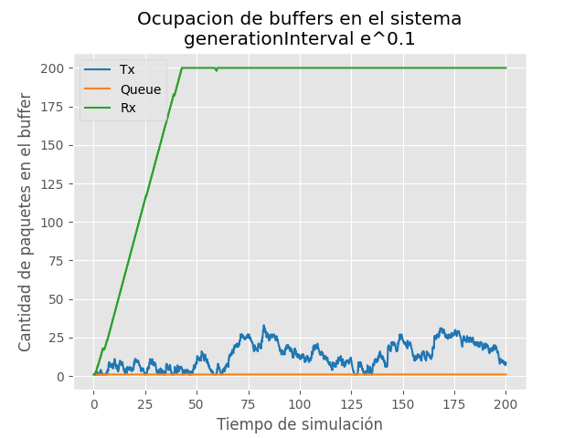

#### Caso 2

En este caso de estudio, las tasas y demoras de transmisión de la red son los siguientes:

- NodeTx a Queue: datarate = 1 Mbps y delay = 100 us
- Queue a NodeRx: datarate = 0.5 Mbps y delay = 100 us
- Queue a Sink: datarate = 1 Mbps
En este caso se manda 1Mbps desde el nodo `Tx` a la cola con un delay de 100 microsegundos y partir de esta manda 1Mbps al nodo `Rx` y 0.5Mbps al `Sink`. Como se puede ver en el gráfico, esto hace que el buffer del nodo `Rx` se mantenga constante durante toda la simulación con 200 paquetes entonces podríamos decir que se congestiona al recibir tantos paquetes con tan poca separación. Mientras que el buffer del nodo `Tx` va variando en capacidad llegando a un pico de 33 paquetes en un momento de la simulación. Esto debe ser porque el nodo `Tx`, en este caso, solo esta generando los paquetes y enviándolos a `Queue`. 
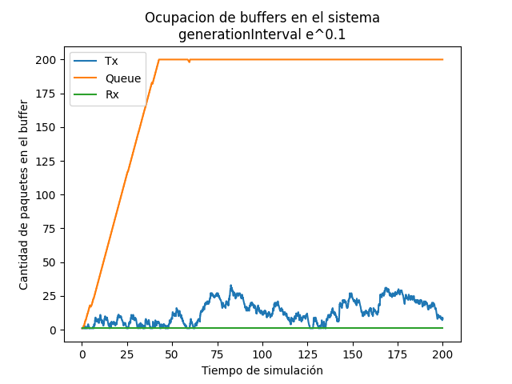

Podemos observar que ambos casos tienen gráficos similares, casi iguales pero lo que los diferencia es que en el caso 1 el buffer del nodo `Rx` es el que esta congestionado mientras que en el caso 2 el buffer congestionado es el de `Queue`. Comparando ambos gráficos podemos deducir que el cuello de botella del caso 1 esta en la transmisión de `Queue` a `Rx` mientras que en el caso 2 esta en la transmisión de `Tx` a `Queue`.
En ambos casos, la cantidad de paquetes que se consumen son aproximadamente la mitad de los paquetes que son generados y enviados.
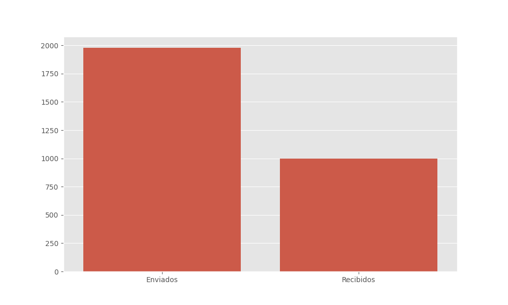

Podemos ver en el siguiente gráfico que el delay promedio es igual para ambos casos ya que en ambos casos existe un problema de control de flujo solo que en distintas partes de la red.

<table>
<thead>
    <tr>
        <th> Caso 1 </th>
        <th> Caso 2 </th>
    </tr>
</thead>
<tbody>
    <tr>
        <td> 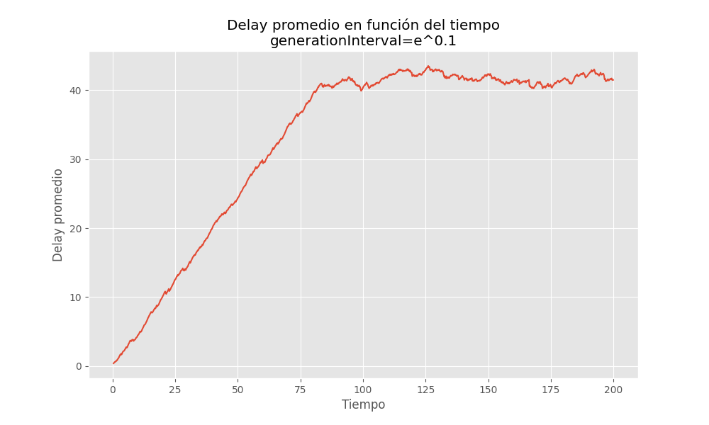</td>
        <td> 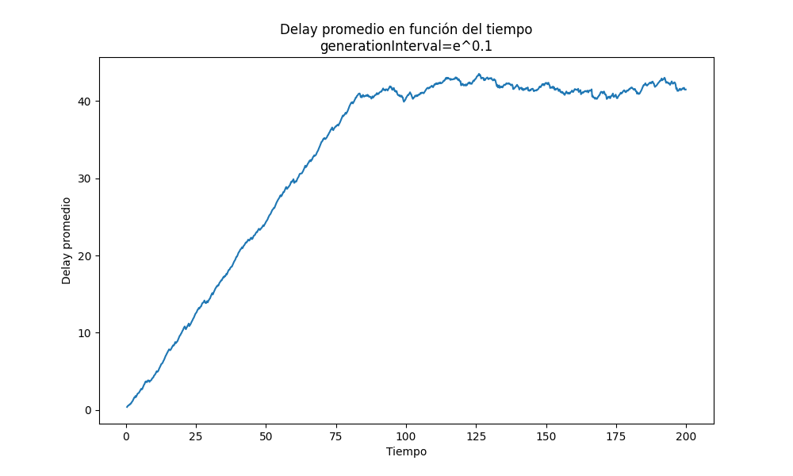</td>
    </tr>
</tbody>
</table>

A continuación mostraremos como afecta el valor del parámetro `generationInterval` en el la simulación:

<table>
<thead>
    <tr>
        <th> generationInterval = exp(0.2) </th>
        <th> generationInterval = exp(0.3) </th>
        <th> generationInterval = exp(0.4) </th>
    </tr>
</thead>
<tbody>
    <tr>
        <td> </td>
        <td> 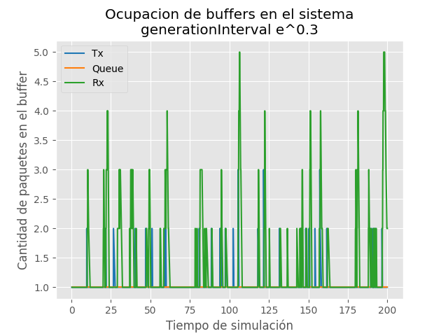</td>
        <td> 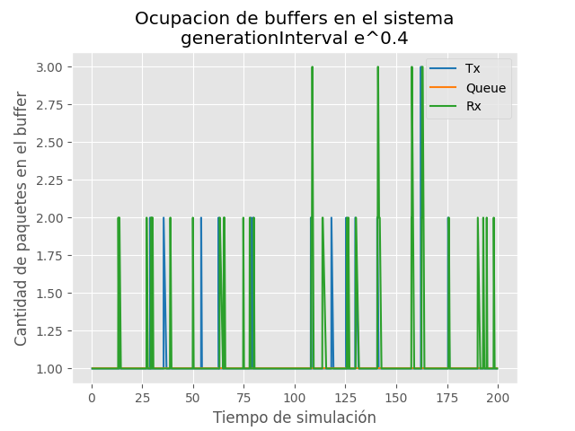</td>
  </tr>
</tbody>

<tbody>
    <tr>
        <td> 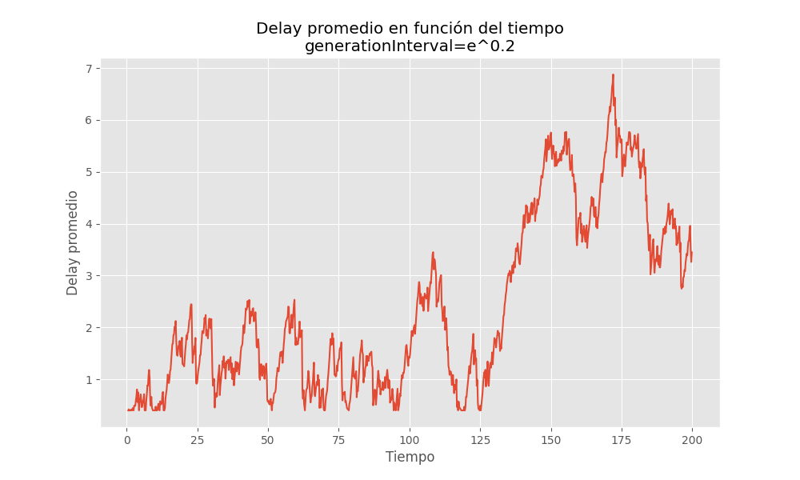</td>
        <td> 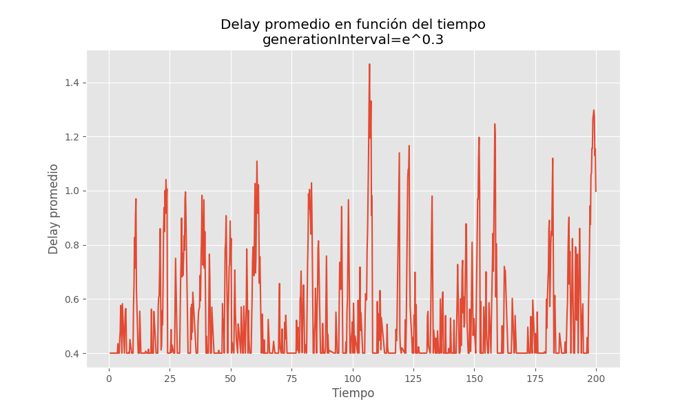</td>
        <td> 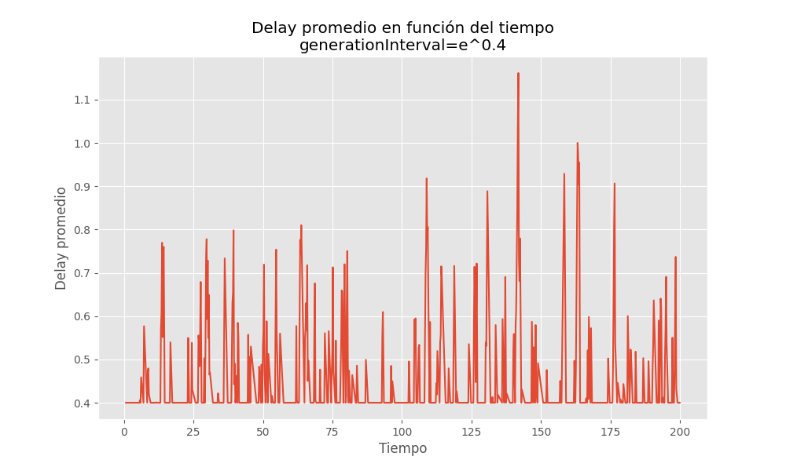</td>
  </tr>
</tbody>
</table>

Se puede ver que a medida que aumenta el valor de `generationInterval` la red se ve menos afectada por el cuello de botella. Nosotros creemos que esto se debe que como hay mas tiempo entre que se generan paquetes y se envian, los nodos tienen mas tiempo para poder mandar los paquetes que le llegan al destino por lo tanto sus buffers no se congestionan de paquetes. Sin embargo, esto tiene un costo en la cantidad de paquetes que se envian como veremos mas adelante. Tambien, el efecto de `generationInterval` se puede ver en como el delay promedio va disminuyendo a lo largo de la simulacion. Osea que como hay menos (casi nada) congestion, el tiempo que un paquete tarde en llegar a `Sink` disminuye. Esto sucede tanto en el caso 1 como en el caso 2, como ambos sufren el mismo problema pero en distinta parte de la red no pusimos graficos del caso 2 ya que son practicamente iguales al caso 1 solo que varian en el buffer mas afectado (el de `Rx` para el caso 1 y el de `Queue` para el caso 2).

Ademas, podemos ver en el gráfico debajo como a medida que aumenta el `generationInterval` disminuye la cantidad de paquetes enviados y recibidos. Sin embargo, la diferencia entre paquetes recibidos y paquetes enviados también va disminuyendo hasta que es casi nula. Osea, el intervalo de tiempo en que distintos paquetes se generan aumenta por lo que se generan menos paquetes en toda la simulación pero al mismo tiempo esto hace que la red no sufra de problemas de flujo y los paquetes que se envían puedan llegar a su destino.
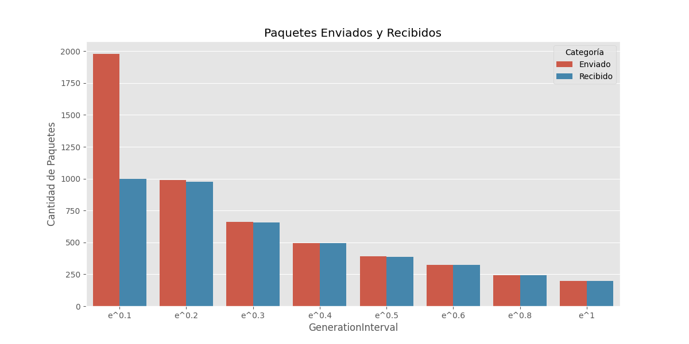

## Método

### Implementación del Control de Flujo y de Congestión

#### Control de Flujo

El control de flujo se implementa para regular la tasa a la que el transmisor (`TransportTx`) envía datos al receptor (`TransportRx`) y así evitar la saturación del receptor. Este mecanismo utiliza un sistema de retroalimentación.

**En el Receptor (`TransportRx`):**

- **Monitoreo del Buffer:** `TransportRx` monitorea constantemente el estado de su buffer, registrando el número de paquetes almacenados.
- **Generación de Feedback:** Cuando el buffer del receptor alcanza ciertos niveles de ocupación, `TransportRx` genera mensajes de retroalimentación que contienen información sobre el estado del buffer, como la cantidad de espacio disponible.
- **Envío de Feedback:** Los mensajes de retroalimentación se envían al transmisor (`TransportTx`) a través de un canal de comunicación, permitiendo que el transmisor ajuste su comportamiento basado en la capacidad del receptor.

**En el Transmisor (`TransportTx`):**

- **Recepción de Feedback:** `TransportTx` recibe los mensajes de retroalimentación enviados por `TransportRx`, actualizándose continuamente sobre la capacidad del receptor.
- **Ajuste de la Tasa de Transmisión:** Basado en la información de los mensajes de feedback, `TransportTx` ajusta su tasa de transmisión. Si el buffer del receptor está cerca de llenarse, el transmisor reduce su tasa de envío de datos.

El algoritmo se basa en dos factores principales para decidir cuántos paquetes enviar: el tamaño del buffer disponible y un índice de confianza. Este índice parte de un porcentaje pequeño de la capacidad disponible y se incrementa a medida que no hay pérdida de paquetes; si se detectan pérdidas, el índice se disminuye. La pérdida de paquetes se detecta si la cantidad de paquetes recibidos es menor que la solicitada. En caso de detectar pérdida de paquetes, el índice de confianza se reduce drásticamente, y el transmisor ajusta su tasa de envío en consecuencia.

#### Control de Congestión

El control de congestión previene la saturación de la red regulando la cantidad de datos que se inyectan en ella. A diferencia del control de flujo, que se centra en la capacidad del receptor, el control de congestión maneja el tráfico de red en general para evitar la sobrecarga.

**En la Cola (`Queue`):**

- **Limitación de Buffer:** La clase `Queue` tiene un límite máximo para su buffer, establecido para prevenir la acumulación excesiva de paquetes que podría llevar a la congestión de la red.
- **Manejo de Paquetes Excedentes:** Cuando el buffer alcanza su capacidad máxima, los paquetes adicionales son descartados para mantener la estabilidad de la red.
- **Registro de Métricas:** `Queue` lleva un registro del número de paquetes descartados debido a la saturación del buffer, útil para analizar el rendimiento de la red y ajustar parámetros si es necesario.

**En `TransportRx` y `TransportTx`:**

- **Retroalimentación de Estado del Buffer:** Similar al control de flujo, `TransportRx` envía información sobre el estado de su buffer al `TransportTx`. En el contexto del control de congestión, esta información se utiliza para prevenir la saturación de la red.
- **Ajuste de la Tasa de Transmisión basado en la Congestión:** `TransportTx` ajusta su tasa de transmisión basándose en los datos recibidos sobre el estado del buffer. Si se detecta un riesgo de congestión, el transmisor reducirá su tasa de envío de datos.

Cuando el buffer del nodo receptor está a punto de saturarse, se envía un mensaje al nodo generador para que deje de enviar paquetes. Después de un tiempo, el nodo receptor habrá consumido y liberado suficiente espacio en el buffer para enviar un mensaje al nodo generador, pidiéndole que reactive el envío. Esto ayuda a prevenir la pérdida de paquetes por colapso en el buffer del receptor.

#### Detalles Clave del Funcionamiento

1. **Control de Flujo:**

   - **Monitoreo del Buffer en `TransportRx`:** Vigila constantemente el nivel de ocupación de su buffer.
   - **Generación y Envío de Feedback:** Genera mensajes sobre el estado del buffer y los envía a `TransportTx`.
   - **Ajuste de la Tasa en `TransportTx`:** Ajusta la tasa de transmisión basada en la información recibida.

2. **Control de Congestión:**

- **Limitación de Buffer en `Queue`:** Establece un límite máximo para el buffer.
   - **Manejo de Paquetes Excedentes:** Descarta paquetes adicionales cuando el buffer está lleno.
   - **Registro de Métricas:** Lleva un registro de los paquetes descartados.

Estos mecanismos trabajan en conjunto para mantener la eficiencia y estabilidad de la red, asegurando que tanto el control de flujo como el control de congestión sean manejados de manera efectiva.


### Hipótesis

Con este nuevo *Diseño con feedback* se creé que al esperar `Tx`, que `Rx`  le devuelva un `FeedbackPkt`, este no podrá enviar más paquetes de datos. Por lo cual se presupone que:

1. La diferencia entre paquetes enviados y recibidos disminuye un factor mayor al 50%.
2. La cantidad de paquetes recibidos disminuye en un factor menor al 50%.
3. `Queue` ya no dropeará **ningún** paquete.
4. En tiempos de generación altos se comporta igual al caso base.
5. Los casos 1 y 2 tendrán comportamientos idénticos.

## Resultados

### 1. La diferencia entre paquetes enviados y recibidos disminuye un factor mayor al 50%. ✅

Ambas versiones presentan la diferencia entre paquetes enviados y recibidos con los intervalos de generación mas bajos (alrededor de e^0,01 segundos) ya que para intervalos mas altos esta diferencia es nula:

- En el caso 1 el algoritmo **mejoró** esta variable en un **676%**.
- En el caso 2 el algoritmo **mejoró** esta variable en un **1145%**.

| Caso | Pkts enviados      |  Pkts recividos  | Diferencia de pkts |
|------|--------------------|------------------|--------------------|
| 1    | de *1979* a *1143* | de *998* a *998* | de *981* a *145*   |
| 2    | de *1979* a *1063* | de *998* a *983* | de *916* a *80*    |

### 2. La cantidad de paquetes recibidos disminuye en un factor menor al 50%. ✅

- En el caso 1 el algoritmo **no sufrió alteraciones sobre los paquete recibidos**.
- En el caso 2 el algoritmo **disminuyo** esta variable solo en un **1,5%**.


<table>
<thead>
    <tr>
        <th> Diseño Base</th>
        <th> Diseño con Feedback</th>
    </tr>
</thead>
<tbody>
    <tr>
        <td> Caso 1 & 2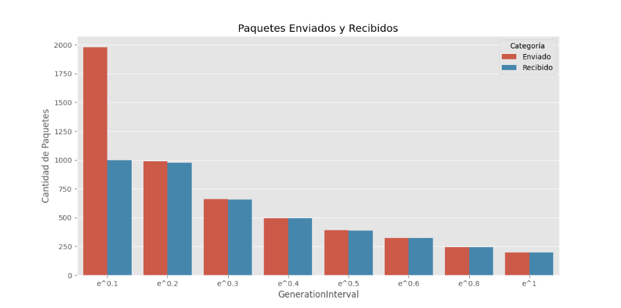</td>
        <td> Caso 1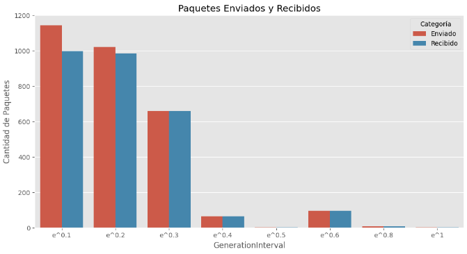Caso 2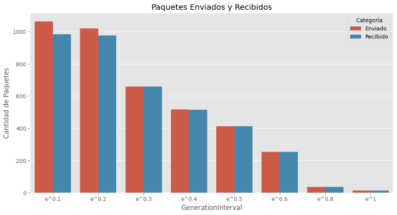</td>
    </tr>
</tbody>
</table>

### 3. `Queue` ya no dropeará **ningún** paquete. ✅

Efectivamente. `Queue` *jamas* alcanza su `bufferSize` de 200 bytes, y por ende, jamas se ve en la necesidad de eliminar paquetes. De hecho jamas toca la cota del 70% estipulada para bajar el trafico.
> El Caso 2 con el tiempo de generación de e^0.1 segundos es en el cual este buffer tuvo mas actividad.
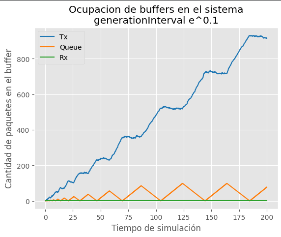

### 4. En tiempos de generación altos se comporta igual al caso base. ❎

Esto fué erróneo. El algoritmo de feedback se comporta de manera muy variable en tiempos de generación bajos. Por ejemplo como se muestra en los gráficos de paquetes enviados vs paquetes recibidos, en el caso 1 disminuye la cantidad de paquetes enviados, mientras que en el caso 2 aumenta con respecto al diseño base, a excepción de los ya inferiores a e^0.8 seg. que los valores te tornan casi nulos.  

### 5. Los casos 1 y 2 tendrán comportamientos idénticos.  ❎

Esta suposición vino del hecho que el algoritmo se implemento a `Rx` y `Tx`, pero no a `Queue`. También esto resultó ser incorrecto. Comparemos por ejemplo la caga de los búferes en distintos intervalos de generación de paquetes:

<table>
<thead>
    <tr>
        <th> Caso 1</th>
        <th> Caso 2</th>
    </tr>
</thead>
<tbody>
    <tr>
        <td> 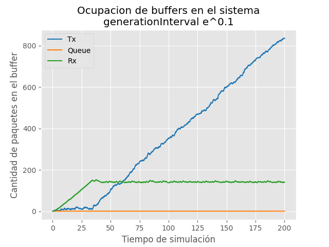 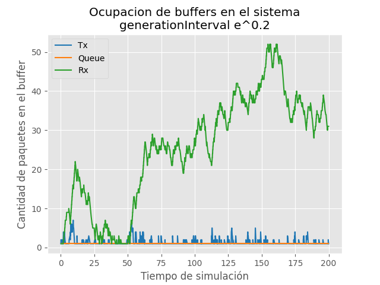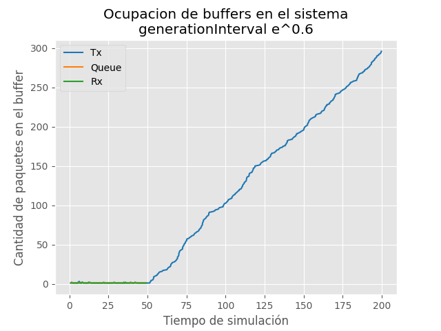</td>
        <td> 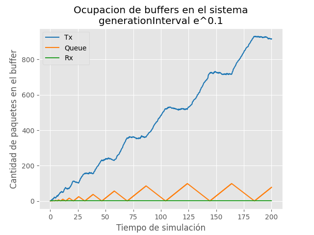 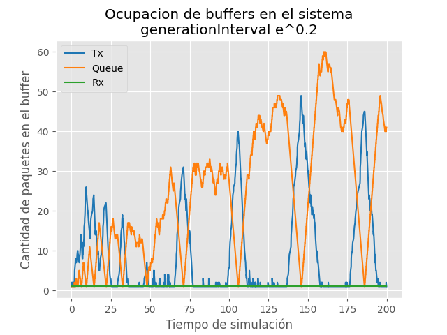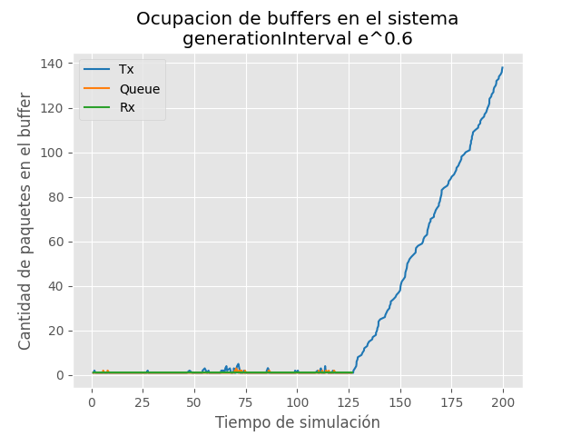</td>
    </tr>
</tbody>
</table>

Es así ya que en caso 1, como el cuello de botella esta entre `Tx` y `Queue`. el buffer de `Queue` se torna nuevamente irrelevante como lo fué en el diseño base.  Vimos también como se ven alteradas las gráficas de paquetes enviados y recibidos.

> Para mas detalles ver el [Jupyer Notebook](./results/INFORME.ipynb).

### Gráficos Comparativos

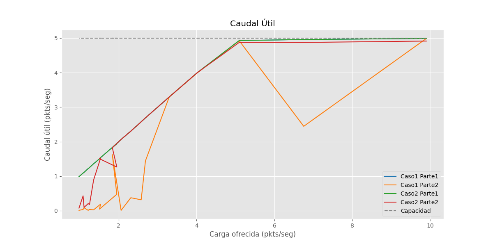
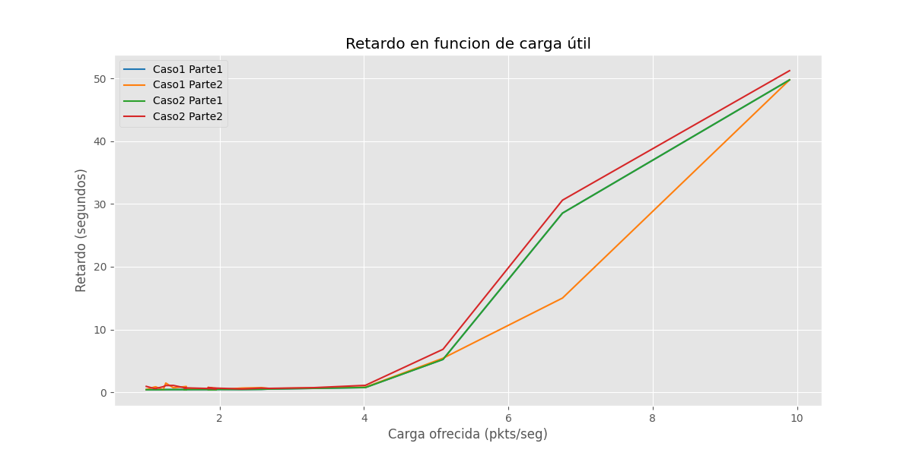

### Conclusiones

Este nuevo diseño es efectivamente un avance con respecto al diseño base, *sobre todo en tiempos de generación altos*, más sin embargo puede mejorarse:

- Su comportamiento en el caso 2. Mientras `Rx` esta patéticamente vacía, tiene que esperar a que `Queue` le mande todos los paquetes para devolver la siguiente petición.
- La política de los puertos. Como `Tx` y `Rx` solo cuentan con un puerto `Semidúplex` seria de gran ayuda que se implemente un algoritmo que establezca "turnos" para mandar y recibir paquetes de manera mas inteligente.
- Su rendimiento en tiempos de generación bajos. En estos casos el algoritmo de feedback deja de ser necesario y se vuelve contraproducente. 

### [Video](https://drive.google.com/uc?id=1z77vlYrqSv2WtRyO69y1yeVfDfO-kqlF&export=download)

## Referencias

- Kurose J. F. Redes de computadores Un enfoque descendente (7ma ed.) Pearson.
- Tanenbaum A. S. Redes de computadores (5ta ed.) Pearson.
- [OMNeT++ Installation guide](https://doc.omnetpp.org/omnetpp/InstallGuide.pdf)
- [OMNeT++ Simulation Manual](https://doc.omnetpp.org/omnetpp/manual/)
- [OMNeT++ TicToc tutorial](https://docs.omnetpp.org/tutorials/tictoc/)
- [Cyclic UDP](https://www.ai.rug.nl/mas/finishedprojects/2011/CUDP/current_page1.htm)
- [TCP Congestion Control](https://datatracker.ietf.org/doc/html/rfc5681#section-3.1)
    > NOTA: En principio se iba a implementar in algoritmo basado en [TCP Reno](https://en.wikipedia.org/wiki/TCP_congestion_control#TCP_Tahoe_and_Reno) (ver en la rama [congDesing](https://bitbucket.org/redes-famaf/redes24lab3g13/branch/congDesing)) ¡Con paquetes de datos estandarizados y todo! Pero esto se descartó ya que requería que los nodos Tx y Rx tengan conexión fullduplex.
- [The Python Language Reference](https://docs.python.org/3/reference/index.html)
- [Matplotlib User Guide](https://matplotlib.org/stable/users/index.html)

### Anexo: *(Sobre IA utilizada en el lab)*

- [Chat GPT](https://chatgpt.com)

    A este se le hicieron básicamente 2 tipos preguntas:

    * Sobre uso especifico de la API de OMNeT como *¿Cómo mando masajes por un puerto inout?* ó *¿Cómo corro simulaciones por consola?*
        
    * Sobre Nociones de las librerías de gráficos de python como *¿Cómo hago un gráfico de barras en grupo?* ó *¿Me describís que es cada parámetro del método plot()?*