# Analisis del trafico de red bajo diferentes estrategias de ruteo

### **Autores**: *Ignacio Gomez* — *Mauricio G. Beckford* — *Wilfredo Avila*

## Introduccion
Una red en anillo es una topologia de red donde cada node se conecta exactamente a otros dos nodos, formando una unica ruta continua. El trafico puede ser unidireccional (en sentido horario o antihorario) o bidireccional. Como en los anillos unidireccionales hay una ruta unica, la comunicacion puede verse interrumpida por la falla de solo un nodo.
En este laboratorio analizamos una red con topologia anillo que consta de 8 nodos, cada uno con dos interfaces de comunicacion full-duplex con posibles vecinos.

    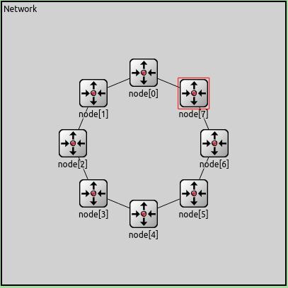

Internamente, cada nodo cuenta con dos capas de enlace (link o lnk, una con cada vecino), una capa de red (net) y una capa de aplicacion (app). La capa de red debe decidir a que nodo le envia el paquete que le llega desde la capa de aplicacion o desde las capas de enlaces inferiores.

    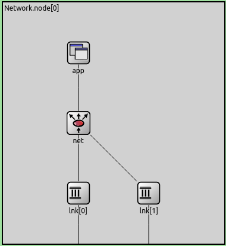

El analisis de ambos algoritmos se realizan en base a dos casos puntuales:

* Caso 1: Los nodos 0 y 2 transmiten datos al nodo 5.
* Caso 2: Los nodos 0,1,2,3,4,6,7 transmiten datos hacia el nodo.

## Algoritmo base
En este algoritmo provisto por el kickstarter, cada paquete que esta recibe es evaluado para determinar si el nodo local es el destino final del mismo. En caso de que lo sea, el paquete es enviado a la capa de aplicacion local. En caso de que el paquete este destinado a otro nodo se elige una interface para re-transmitirlo. La capa de red elige siempre la interface numero 0 (`toLnk[0]`) que es la que envia el trafico en sentido horario a lo largo del anillo hasta llegar al destino.

### ¿Que observamos del algoritmo base?
#### Caso 1
Aqui se puede ver como va incrementando el delay promedio a medida que avanza la simulacion, indicando un problema de congestion.

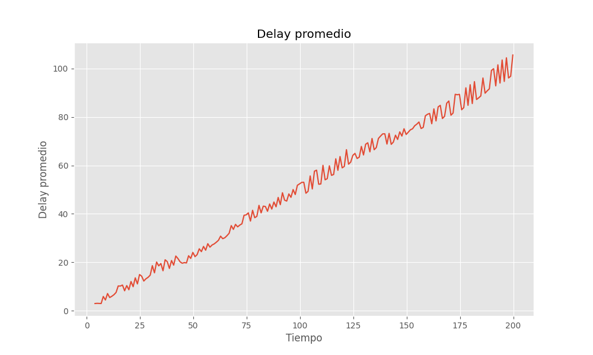

Se puede ver en el siguiente grafico de la ocupacion de buffers de cada nodo que el buffer de `node[0]` va aumentando su tamano a medida que avanza el tiempo meintras que el buffer del resto de los nodos casi no aumenta. Creemos que esto sucede porque el `node[2]` le envia los paquetes a `node[5]` a traves de los nodos `node[1]`, `node[0]`, `node[7]` y `node[6]`. Pero el problema subyace en que `node[0]` ademas de recibir paquetes de `node[2]`, esta generando y enviando paquetes a `node[5]`. Esto hace que el buffer de `node[0]` se congestione de paquetes.

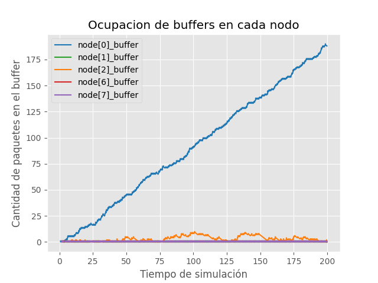

Los paquete tienen que pasar por, como maximo 6 enrutadores para llegar a su destino.

### Caso 2
En este caso, todos los nodos (menos `node[5]`) envian paquetes a `node[5]` en sentido horario provocando que los nodos tengan que procesar mas paquetes de lo que generan y esto hace una especie de acumulacion de paquetes de nodos previos mas los del nodo actual. Se puede ver nuevamente un incremento en delay promedio a lo largo de la simulacion.

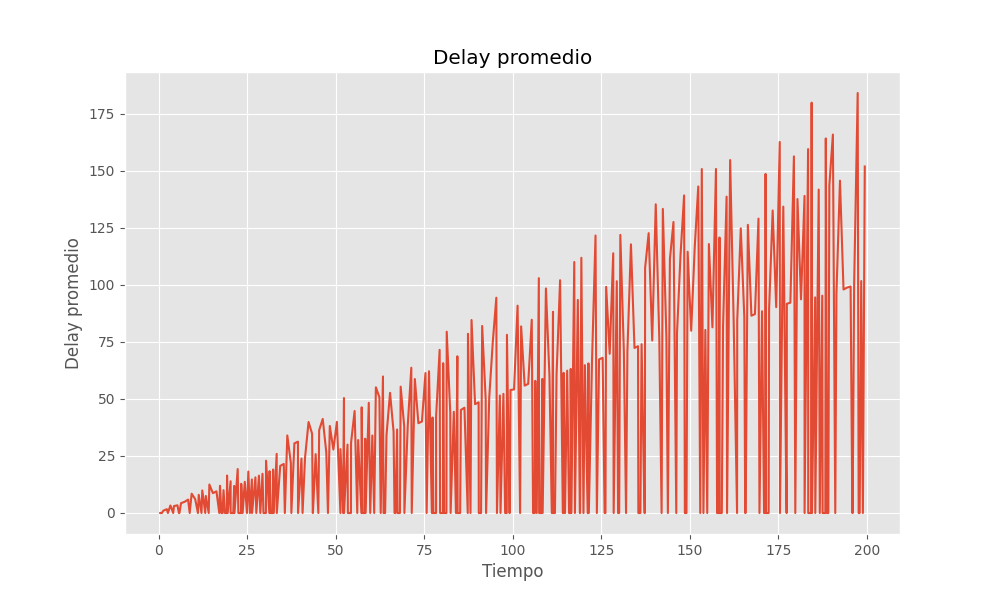

En este caso, los buffers de todos los nodos, menos el 4, van incrementando en su ocupacion a lo largo de la simulacion. El `node[4]` no se congestiona debido a que se encuentra al lado de `node[5]`, por lo tanto no le llegan paquetes de otros nodos.

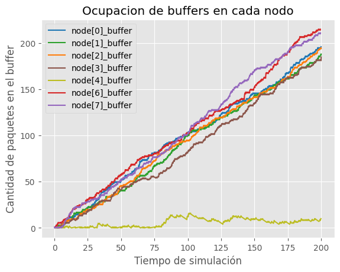

### Que se puede hacer para reducir la congestion?
Experimentamos con distintos valores de `interArrivalTime` para ver cual reducia los problemas de congestion.
<table>
<thead>
    <tr>
        <th> interArrivalTime = exp(0.1) </th>
        <th> interArrivalTime = exp(0.5) </th>
        <th> interArrivalTime = exp(0.7) </th>
    </tr>
</thead>
<tbody>
    <tr>
        <td> 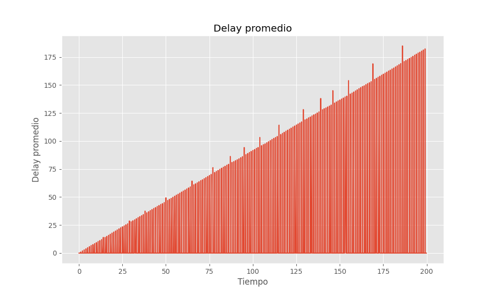</td>
        <td> 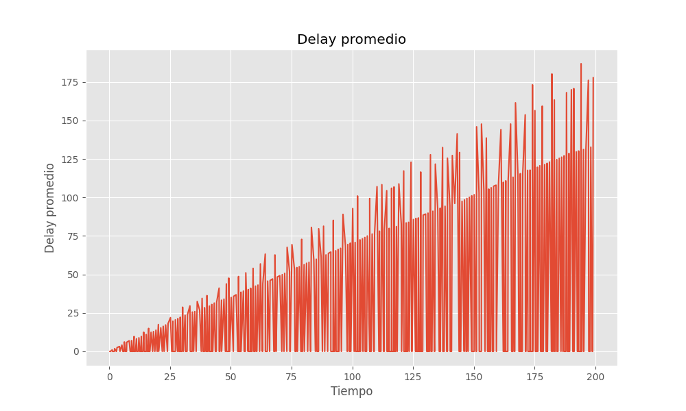</td>
        <td> 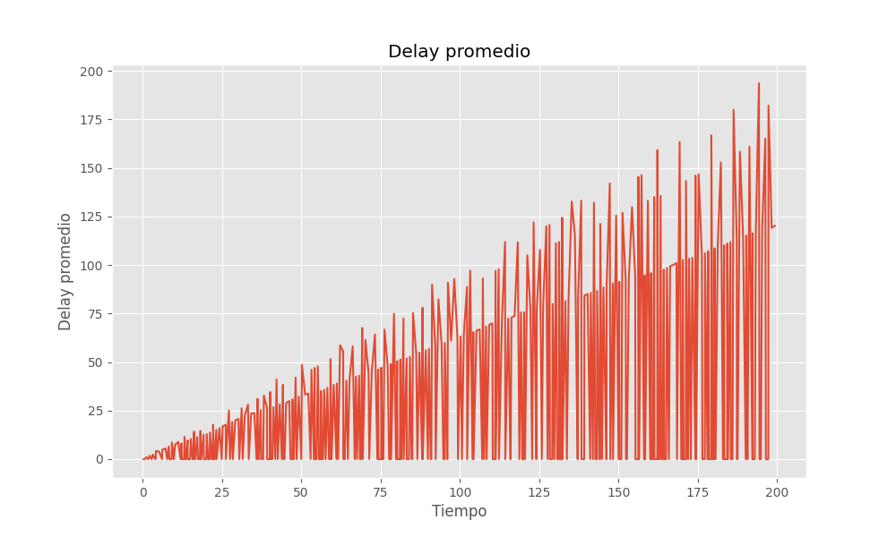</td>
  </tr>
</tbody>
<tbody>
    <tr>
        <td> 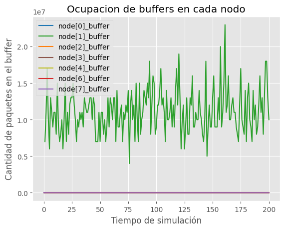</td>
        <td> 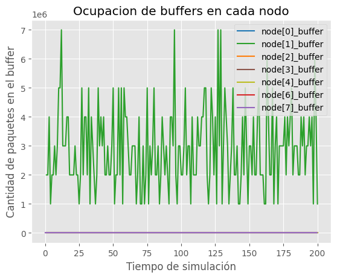</td>
        <td> 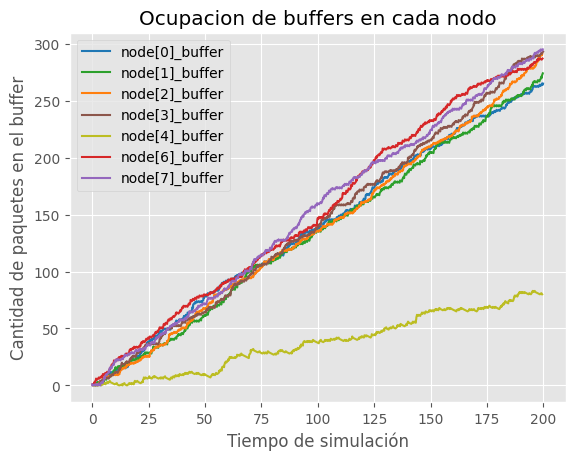</td>
  </tr>
</tbody>
</table>

Podemos ver que con `interArrivalTime` seteado a un valor entre `exponential(0.1)` y `exponential(0.5)`  se logra reducir la congestion, pero a medida que aumentamos ese valor va surgiendo el problema de congestion.

Ademas, podemos observar como la ocupacion de los buffers disminuye significativamente, menos para `node[6]` y `node[7]`. Esto es porque estos nodos se encuentran al final del recorrido previo a llegar al nodo destino, por lo que le llegan una mayor cantidad de paquetes que al resto.

Entonces, podemos observar que al aumentar el `interArrivalTime` podemos reducir la congestion en la red pero esto hace que la velocidad del trafico sea mucho mas lenta y se puedan transmitir menos paquetes. Por el otro lado, al disminuir `interArrivalTime` se aumenta la velocidad de la red pero eso hace que se sobrecarguen los buffers de los nodos y, asi congestionando la red.

## Algoritmo nuevo
El algoritmo se implementa principalmente en tres módulos: App, Net y Lnk, cada uno con funciones específicas dentro de la red.

### Módulo App

- Este módulo se encarga de la generación de paquetes y su envío a la capa de red (Net).
- La generación de paquetes se basa en un tiempo de interarribo definido por el parámetro interArrivalTime.
- Los paquetes son creados y enviados a intervalos regulares, y las estadísticas de los paquetes generados y los retrasos se registran para análisis posteriores.

### Módulo Net

- Este módulo recibe los paquetes del módulo App y decide por cuál enlace (Link) enviarlos.
- Implementa una lógica de enrutamiento simple, donde los paquetes se envían siempre por el primer enlace disponible.

### Módulo Lnk

- Este módulo se encarga de recibir los paquetes del módulo Net, almacenarlos en un buffer y enviarlos al nodo siguiente.
- Si el buffer alcanza un umbral definido, se genera un paquete de retroalimentación que informa a los nodos generadores sobre el estado del buffer.
- Los paquetes en el buffer se procesan de acuerdo con el tiempo de servicio definido y se envían en orden.

### Proceso de Generación y Envío de Paquetes

### Inicialización

- En el módulo App, se inicializan los parámetros de generación de paquetes (interArrivalTime, packetByteSize, destination).
- No se programa ningún evento de envío hasta que la inicialización esté completa.
- Además, se espera recibir un mensaje de inicialización completa (InitComplete) desde otros módulos para comenzar a enviar paquetes. Este mensaje asegura que todos los nodos en la red estén listos antes de iniciar la transmisión de paquetes.
- Se crea el paquete`EchoPacket` que cuenta el número de nodos en el anillo por medio del incremento en su número de saltos al recorrer la red.

#### Generación de Paquetes

- Una vez completada la inicialización, se programan eventos de generación de paquetes a intervalos regulares basados en `interArrivalTime`.
- Cada paquete generado contiene información sobre su origen, destino y tamaño en bytes.

#### Enrutamiento de Paquetes

- Los paquetes generados son enviados al módulo Net, que decide el enlace de salida.
- Cada Nodo ahora tiene la nueva tarea de:
    - Cualquier paquete que no tenga a este nodo como destino, debe reenviarlo por el enlace opuesto por el cual llego.  
    - Actualizar datos como número de saltos de cada paquete o el enlace por el cual se manda.

# Hipótesis

Con este nuevo Diseño  se cree que la capa de red de cada nodo:

- Logrará bajar al mínimo el número de saltos de TODOS los paquetes de datos.
- Por ende la el mayor número de saltos bajará a 4 (del nodo[1] al nodo[5]).
- No se saturará ningún buffer totalmente.
- Nunca se enviará un paquete de datos ente el nodo[1] y el nodo[0].

### Caso 1
Para solucionar el problema que sucedia con el algoritmo base, utilizamos los nodos que no estaban siendo utilizados (`node[3]`, `node[4]`, `node[5]`) para enviar los paquetes desde `node[2]`.
Como se puede ver en la imagen debajo, se logro reducir la cantidad de saltos

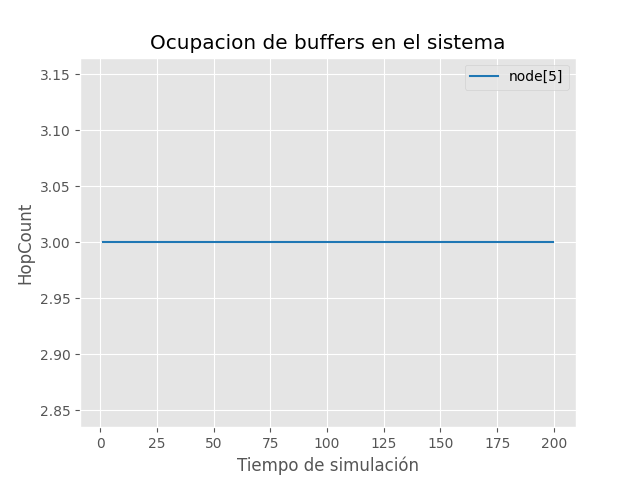

Ademas, el delay promedio disminuye significativamente con respecto a lo que daba con el algoritmo base por lo tanto se evita la congestion por completo. 

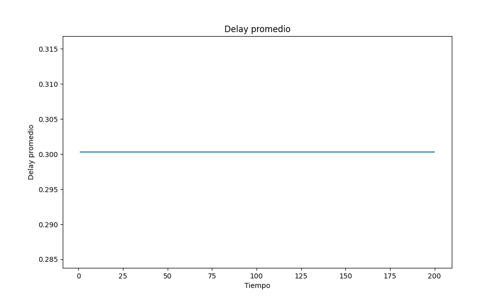

Esto tambien se puede ver en la ocupacion de buffers.

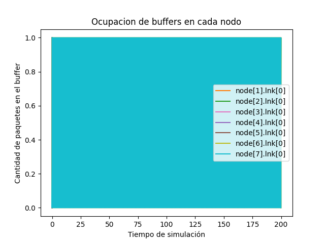

## Caso 2
En este caso, podemos observar que hay un aumento en la cantidad de saltos pero no tan grande.

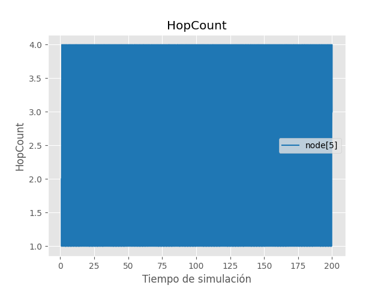

Ademas, se puede ver que el delay promedio tambien disminuye considerablemente y que no hay incremento de ocupacion de buffers.

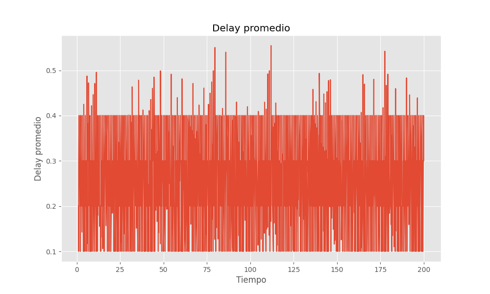
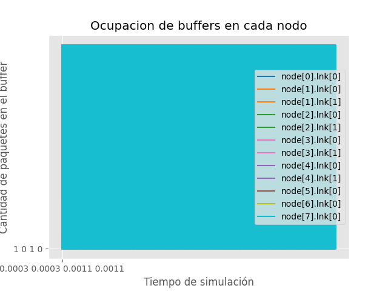

Es notable la mejora de el enrutamiento en utilzando este algoritmo en comparacion al algoritmo base. Se evita por completo la congestion, se reduce considerablemente el delay promedio y consecuentemente hay un incremento en la cantidad de paquetes que llegan a destino, y se reduce la cantidad de saltos que tiene que hacer un paquete para llegar a su destino.

# Conclusion
En conclusion, observamos que el algoritmo que implementamos logro, ambos casos:

- Reducir considerablemente la congestion en los buffers de los nodos
- Enrutar inteligentemente los paquetes, disminuyendo la cantidad de saltos necesarios para que un paquete llegue a destino
- Disminuir el delay promedio.

Por el otro lado, el algoritmo base:

- Depende mucho de la topología de anillo.
- Provoca que se descarten muchos paquetes paquetes al principio mientras examina y actualiza la topología.
- No hace actualizaciones de la topología ni control de paquetes.

## Referencias
- [Red en anillo](https://es.wikipedia.org/wiki/Red_en_anillo)
- Kurose J. F. Redes de computadores Un enfoque descendente (7ma ed.) Pearson.
- Tanenbaum A. S. Redes de computadores (5ta ed.) Pearson.
- [OMNeT++ Installation guide](https://doc.omnetpp.org/omnetpp/InstallGuide.pdf)
- [OMNeT++ Simulation Manual](https://doc.omnetpp.org/omnetpp/manual/)
- [OMNeT++ TicToc tutorial](https://docs.omnetpp.org/tutorials/tictoc/)
- [The Python Language Reference](https://docs.python.org/3/reference/index.html)
- [Matplotlib User Guide](https://matplotlib.org/stable/users/index.html)